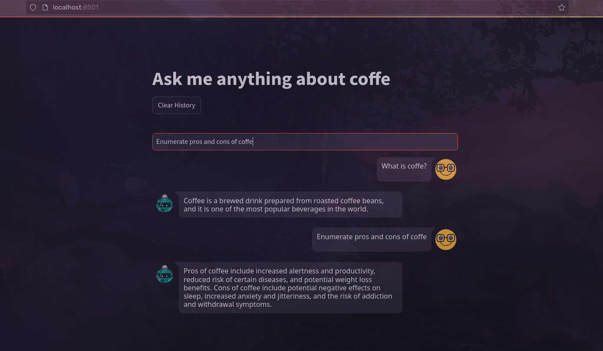

# QA Langchain Project

This project is a QA (Question Answering) application that uses Langchain to process and answer questions about coffee. The application is built using Streamlit for the web interface and integrates with OpenAI for generating responses.YOUTUBE SOURCE: https://www.youtube.com/watch?v=swwXhsl-PJ4&t=209s




## Project Structure

### Files and Directories

- `.env`: Contains environment variables, such as the OpenAI API key.
- `app/`: Contains the main application code.
  - `app.py`: The main entry point for the Streamlit application.
  - `qa.py`: Contains the `QAModel` class for processing and answering questions.
  - `sources.txt`: A file containing URLs to sources about coffee.
  - `store/`: Directory to store vector data.
- `docker.sh`: Script to build and run the Docker container.
- `Dockerfile`: Dockerfile to create a Docker image for the application.
- `requirements.txt`: List of Python dependencies.
- `.gitignore`: List of files/directories to ignore

## Installation and use

- Go to https://app-openai-langchain-coffe.streamlit.app/ to real deployment using Streamlit

### Prerequisites

- Python 3.9
- Docker

### Steps

1. Clone the repository:

```sh
git clone <https://github.com/Wallyway/QA-OpenAI-LangChain>
```

2. Set your OpenAIKey in `.env`:

```sh
https://platform.openai.com/api-keys
```

3. Execute `docker.sh`:

```sh
bash docker.sh
```

4. The application will be accessible at http://localhost:8501

